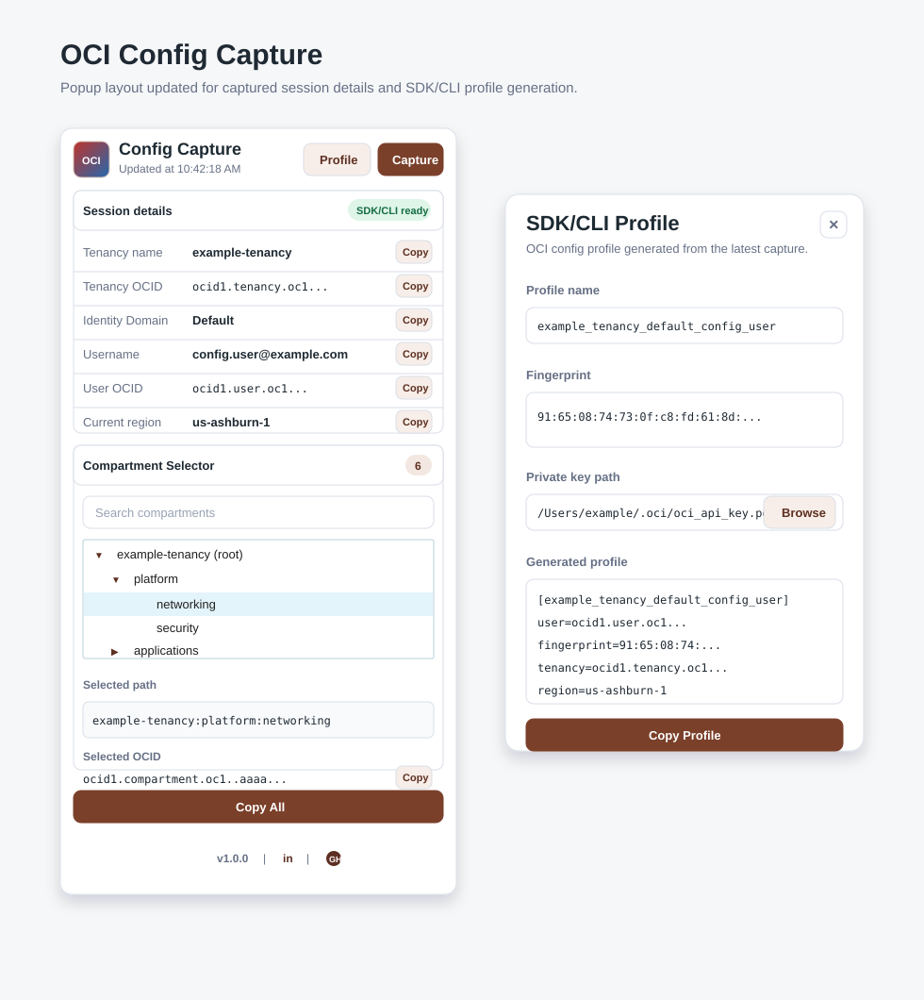

# OCI Config Capture

A lightweight Manifest V3 Chrome extension that captures key details from the currently active Oracle Cloud Infrastructure (OCI) Console session and displays them in a compact popup.

The extension is designed for quick inspection of the signed-in OCI Console context: tenancy, identity domain, user, region, and accessible compartments.

## Features

- Manual **Capture** button for reading the active OCI Console tab on demand
- Clean popup UI with copy buttons for every captured value
- OCI Console session detection and error handling
- Tenancy and identity-domain user details from the active browser session
- Current region detection, including OCI short-region code normalization
- **Copy All** button that copies captured values in `key: value` format
- Compartment selector with:
  - accessible compartment retrieval from OCI Console/API/cache data
  - compact parent/child tree hierarchy
  - expandable and collapsible compartment branches
  - search/filter that keeps matching branches visible with their ancestors
  - selected compartment path from root to selected compartment, separated by `:`
  - selected compartment OCID display and copy button
- Footer links for the project version, LinkedIn profile, and GitHub repository

## Captured Information

The session panel displays fields in this order:

1. Tenancy name
2. Tenancy OCID
3. Identity Domain
4. Username
5. User OCID
6. Current region

The compartment selector displays compartment names in a compact hierarchy. The selected compartment path and selected compartment OCID appear below the tree.

## Install as an Unpacked Extension

1. Clone or download this repository.
2. Open Chrome and go to `chrome://extensions`.
3. Enable **Developer mode**.
4. Select **Load unpacked**.
5. Choose this repository folder.
6. Open an OCI Console tab and sign in.
7. Click the **OCI Config Capture** extension icon.
8. Click **Capture** to read the active OCI Console tab.

No build step is required.

## Usage

1. Open a signed-in OCI Console tab.
2. Open the extension popup.
3. Click **Capture**.
4. Use **Copy** next to any field to copy its value.
5. Use the compartment tree to expand/collapse parent compartments.
6. Select a compartment to show its root-to-selection path in **Selected path** and its OCID in **Selected OCID**.
7. Use the search box to filter compartments; matching children remain visible with their parent path.
8. Use **Copy All** to copy the visible captured values in `key: value` format.

## How It Works

The popup asks the background service worker to inspect the active tab. If the active tab is an OCI-related Oracle Cloud host, the extension injects a content script and page probe into that tab.

The page probe runs in the OCI Console page context and gathers session hints from:

- OCI Console browser storage
- OCI Console IndexedDB caches, including `opc-key-store-v2` session tokens and cached compartment data
- decoded JWT payloads from the active identity-domain session
- selected page-level globals when present
- visible Console text and bootstrap script data as fallbacks
- optional same-session OCI Console/API endpoint probes when available

Username and User OCID are prioritized from the active Identity Domain session/principal data. The extension avoids treating groups, policies, roles, and other IAM metadata as the connected user.

For compartments, the extension uses the tenancy OCID from the active session and attempts OCI Identity compartment data with `accessLevel=ACCESSIBLE` and `compartmentIdInSubtree=true`. If a live API request is unavailable, it falls back to cached OCI Console compartment records from IndexedDB. Parent IDs and cached path data are used to build the tree hierarchy.

Direct regional OCI Identity REST calls can return `401` in a normal browser Console session because they are unsigned OCI API requests. The extension treats those calls as optional probes and does not surface expected authorization misses as user-facing errors.

## Source Layout

```text
manifest.json          MV3 extension manifest
src/background.js      Active-tab validation and script injection
src/content.js         Isolated-world bridge and response normalization
src/page-probe.js      OCI session, user, and compartment extraction
popup/popup.html       Popup markup
popup/popup.css        Popup styling
popup/popup.js         Popup state, copy buttons, and compartment tree logic
docs/sample-ui.svg     Example popup layout
icons/                 Extension icons
```

## Popup Layout

The sample below reflects the current popup: ordered session fields, copy buttons, compact expandable compartment tree, selected path, selected OCID, Copy All, and footer links.



## Privacy and Data Handling

- The extension only reads the active tab when you click **Capture**.
- Captured values stay local to the browser extension popup.
- The project does not send OCI data to any external service.
- If the active tab is not OCI Console, or session data cannot be read, the popup shows an error instead of failing silently.

## Development

This is a plain JavaScript Chrome extension with no build pipeline.

Useful validation commands:

```bash
node --check popup/popup.js
node --check src/content.js
node --check src/page-probe.js
node -e "JSON.parse(require('fs').readFileSync('manifest.json','utf8')); console.log('manifest ok')"
```
